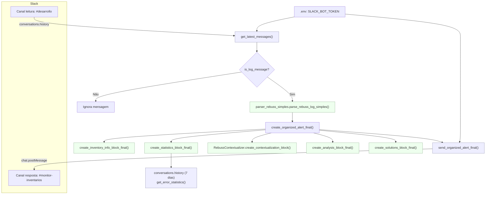
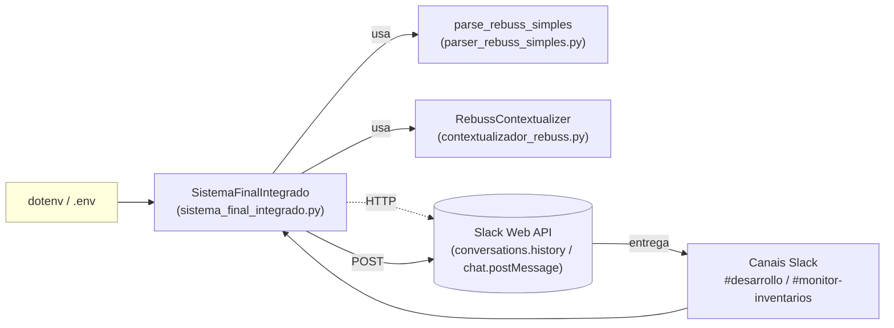

# Diagrama do Sistema de Vigilância Rebuss

Este arquivo apresenta dois diagramas Mermaid: o fluxo principal de processamento e a visão de componentes do sistema.

## Fluxo Principal

## Visão de Componentes

---

Notas rápidas
- Loop contínuo: `start_monitoring()` chama `process_new_messages()` a cada 30s.
- Estatísticas: `get_error_statistics()` consulta o histórico de 7 dias no Slack.
- Contexto: `RebussContextualizer` infere controller/action e intenção do usuário.

